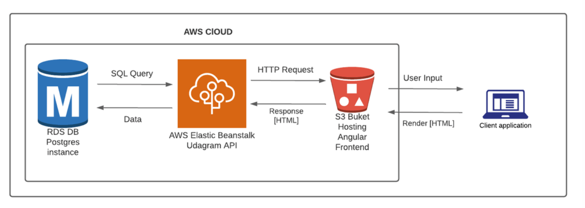

## Infrastructure description

### This app has two main parts:

- udagram-api: This is a REST API application that provides functionality for incoming requests for Feeds and Users.
- udagram-frontend: This is an Angular application that displays the UI, gets and sends requests to the udagram-api application.

### The app hosting on AWS:

- Udagram front-end will be set up on S3.
- Udagram back-end will be set up on Elastic Beanstalk.
- The data will be stored in a Postgres database managed by RDS.
