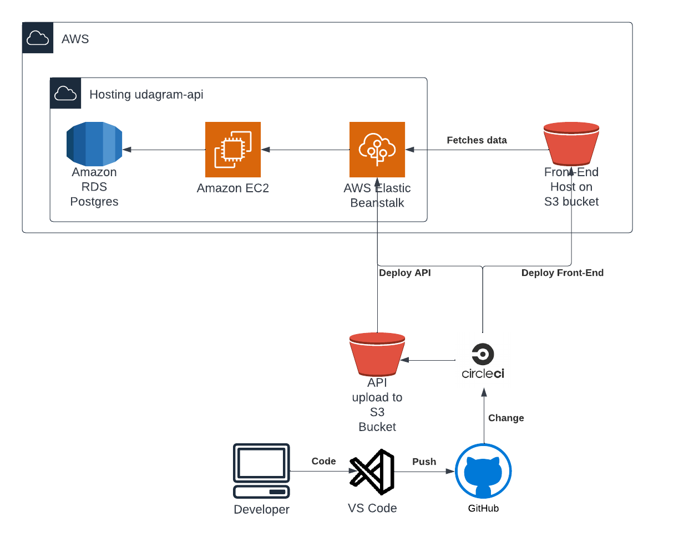

## Pipeline description

### Code Commit:

The first step is to commit your code changes to a version control system like Git. This could be done by pushing your code to a repository on GitHub or a similar platform.

### Build:

Once your code is committed, the pipeline triggers a build process. During this step, the necessary dependencies are installed, and the code is compiled or transpiled if needed. The build process ensures that your code is ready for testing and deployment.

### Testing:

After the build is complete, the pipeline runs automated tests to verify the functionality and quality of your code. This can include unit tests, integration tests, and end-to-end tests. The tests help catch any bugs or issues before deploying the code.

### Deployment:

If the tests pass successfully, the pipeline proceeds to deploy your application. This involves deploying the backend API to AWS Elastic Beanstalk and the frontend to AWS S3 for web hosting. The deployment process ensures that your application is available and accessible to users.
